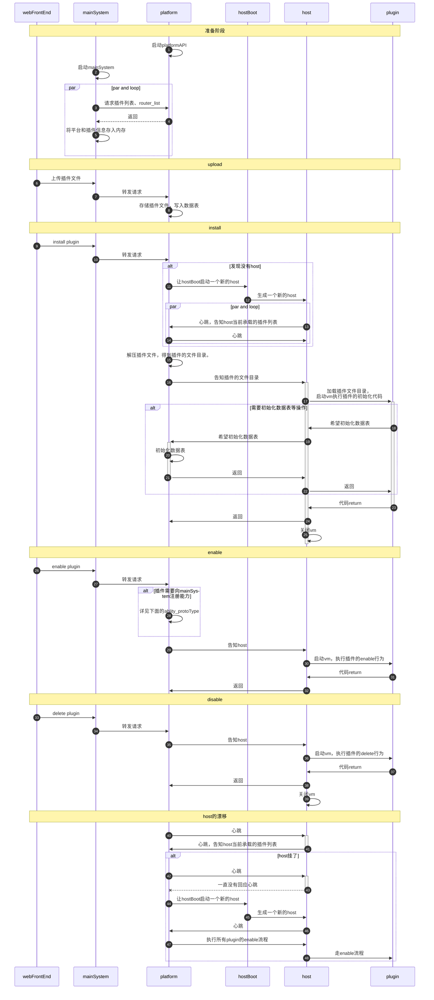
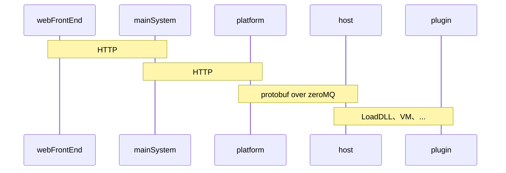
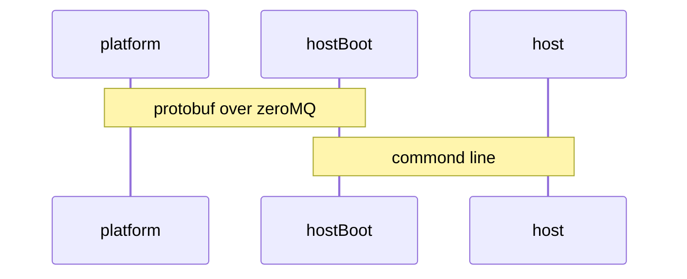
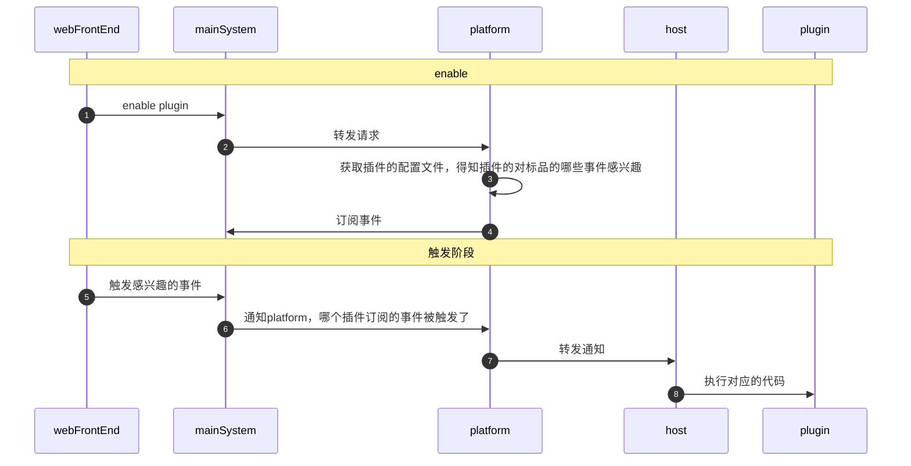

# plugin-platform

## 简介

Web Server 的通用插件框架。抽象出供二次开发使用的代码框架与对应的工具集，使得开发人员能够低成本、高效率的拓展 Web 系统能力，满足定制化需求。


## 特性

- `低开发成本`：**大量使用声明替代代码开发**，进一步降低开发者学习成本和开发门槛； 
- `强开放能力`：基于现有系统功能模块，提供全面的二次开发能力； 进行了良好的能力模型抽象，易于理解的同时，满足深度定制；


## 组件

- `mainSystem`：主系统的后台。
- `platform`：插件平台。负责管理插件的生命周期、插件的配置、自定义权限点、往各个组件注册插件使用的能力。
- `hostBoot`：接收平台的指令，对 host 的启用、停用，解决各种语言的 host 启用差异。（只在 host 启动、停用、漂移时有用）
- `host`：插件运行的载体，负责运行插件。
- `plugin`：插件。没有任何主动能力，本质是存有静态代码和配置文件的目录。

数据流基本走向：

```
webFrontEnd -> mainSystem -> platform -> host -> plugin
```


### plugin 组件

plugin 本质是静态的代码文件和配置文件。因为插件可以是第三方开发的，因此我们不能对插件的安全性做任何假设。

插件在运行的时候，一旦需要调配资源，包括存储、网络甚至计算资源，来完成其自身的功能，都不能简单的像在本地开发运行代码一样，直接用某个库来访问系统 API。所以，我们可以简单的理解为，除了 CPU、内存相关的运算，插件做任何事情，都**需要通过通讯来完成**。


### 为什么需要 host 组件

为什么需要 host 组件？

答：插件代码是静态的，需要一个组件去加载执行。


为什么 platform 不可以充当 host 组件（即把加载执行插件的逻辑放在 platform 上）？

答：理论上是可以的，实际上不会这么操作。

插件可以基于多种语言开发，不同语言的代码需要不同的加载方式

- 在 golang 版本中，使用 `plugin.Open(soFile)` 去加载 SO 文件
- 在 node 版本中，使用 `vm` 去加载 JS 代码

如果全放在 platform 上，将会十分的臃肿，且耦合度高。

所以，host 还肩负一个职能：**解决多语言问题**。


### 为什么需要 hostboot 组件

host 功能本质就是：运行插件的代码。插件需要频繁的启停，且插件代码的安全性可靠性无法保证，所以 host 极有可能会挂掉。

为了保证 host 的可用性，当 host 挂掉的时候，需要有另一个组件去启动一个新的 host，并且将正在启用的插件全部恢复迁移到新的 host 组件上（也就是漂移）。这就是 hostboot 组件。

> hostboot 的功能本质：当系统内没有 host 组件时，启动一个 host；当 host 挂掉的时候，启动一个新的 host，并且将旧 host 上承载的插件漂移到新的 host 上。


怎么保证 hostboot 不会挂掉？

答：暂时无法保证。

- hostboot 的功能简单且单一，挂掉的概率不高。
- 如果需要，后续可以使用 k8s 实现高可用。
- 或者水平扩展，部署多个 hostboot 提高可用性。


### plugin-platform 组件

综上：

- plugin 组件：只是静态代码和静态的配置文件。完全被动，本身没有任何状态。
- Host 组件：负责执行 plugin 组件中的代码，platform 通过通讯指导 host 的行为。即：host 的所有状态和信息都来自其他组件。
- Hostboot 组件：系统正常时，完全用不到他。

可以看到，plugin、host、hostboot 组件都是无状态、无信息的，因此需要一个组件去维护所有插件的状态和信息

Platform 的功能：

- 维护所有插件的状态和信息。
- 向 host、hostboot 发送信息，指导这两个组件的行为。


## 组件间的数据流




## 通讯协议



- platform 和 host 通讯：使用 zeroMQ 实现跨主机的 TCP 连接，数据格式使用 protocol buffer。
- host 和 plugin：严格来讲不算是通讯，取决于不同语言不同的加载方式。其中 golang 的 LoadDLL 方式 和 node 的 vm 方式都是同主机同进程通讯。




- hostboot 启动一个新的 host，就是 bash 执行一段脚本而已。


### 为什么使用 zeroMQ

- platform 需要和 host 和 hostboot 保持心跳，使用 HTTP 效率低，而且 HTTP 是无连接的，应答机制不够及时，不如使用 TCP。
- 在平台业务中，TCP 通讯需要使用到点对点，扇出等等模式，也有各种错误需要处理，如果自研 TCP 通讯中间件就是造轮子，自研坑也很多，还不如使用现有的解决方案 zeroMQ。
- 后续平台需要多节点、高可用什么的，使用 zeroMQ 也更容易扩展。


### 为什么使用 protocol buffer

- 协议兼容，新增一个字段不会影响到旧插件的使用。


## 插件能力

对于单个插件而言，无论其使用的语言和框架，我们都认为**插件代码自身是无权限的。 或者说，插件运行时环境，是从属于某个无权限账号启动的进程上的**。插件不能访问系统资源，更不能访问其它插件的数据等。

插件在运行的时候，一旦需要调配资源，包括存储、网络甚至计算资源，来完成其自身的功能，都不能简单的像在本地开发运行代码一样，直接用某个库来访问系统 API。所以，我们可以简单的理解为，除了 CPU、内存相关的运算，插件做任何事情，都**需要通过通讯来完成**。

> 例如，当插件需要写入一个文件时，不能简单的通过 open 来获取 fd 并进行对应的读写操作，而是需要向平台发送一个封装好的数据包（请求消息）来获取文件标识，并基于此标识在后续进行读写。插件不能也不需要知道这个文件具体存储在哪台机器的哪个磁盘上。

通过这样的设计，我们将插件功能的实现和这些功能的使用者进行了全方位的解耦，使得底层架构能够更灵活的适配和调整。而这些请求，就是我们所说的开放能力。

以上这些论述，都是从技术层面说明一个开放能力所发挥的作用。而从业务上，我们的开放能力，则是**插件开发者所能定义、修改系统功能的最小单位，以及所能使用、访问现有系统资源的最小单位**。


### 四类能力

插件的能力可以分成四类：

- `基础设施层`：插件拥有自己的：文件空间、日志、配置
- `存储层`：插件能访问：主系统的数据库，自己的数据库
- `路由层`：插件能够：访问外部网络、提供HTTP服务。
- `业务实现层`：插件能够将自己的能力注入系统


基础设施层：

- `Workspace`：提供一个文件目录，让插件有存储能力。
- `log`：让插件支持写入日志。

存储层：

- `SysDB`：让插件支持访问主系统的数据表。
- `LocalDB`：让插件支持插件自定义数据表。

路由层：

- `network`：让插件支持通过通讯，告知 platform，由 platform 访问外网，再将消息还给插件。从插件视角看来，就像是插件拥有访问外网的能力一样。
- `socket`：Nginx 注册一个 url，当外部请求到达 platform 后，platform 将其转发给插件，变相实现插件的向外提供服务。

业务实现层：

- `event`：插件订阅主系统的一些事件。
- `API`：劫持注入主系统的所有业务接口。包括 prefix、suffix、replace、addition、external

- `ability`：将标品现有的比较小的功能点抽出来作为一个接口，供插件使用。（比如将标品的发送短信功能，抽离成一个接口）
- `ability_protoType`：标准能力，插件向标品提供 diy 能力（ablilty_prototype）。比如自定义通知渠道。


### 插件业务实现层的三个能力

插件利用`基础设施层`、`存储层`、`路由层`的能力，就是为了将某些能力注入到主系统中。这就是插件`业务实现层`的能力。

#### event publisher

**作用原理类似于观察者模式**。让插件有了订阅事件的能力。插件向主系统订阅事件，当主系统事件发生时就会自动触发插件的OnEvent函数。

```go
type EventPublisher interface {
	Subscribe(condition []string) PluginError // 不支持通配符, ex: project.task.create
	SubscribeWithFilter(condition []string, filter map[string][]string) PluginError // 支持过滤条件, ex: filter: project_uuid_in:[""]
	Unsubscribe(condition []string) PluginError  // 支持通配符
}
```

```go
// 插件在安装的时候，订阅"project.task", "project.user"两个事件
func (p *mockPlugin) Install(common_type.LifeCycleRequest) common_type.PluginError {
	event := p.resource.GetEventPublisher()
	cnd := []string{"project.task", "project.user"}
	er := event.Subscribe(cnd)
	if er != nil {
		panic(er)
	}
	return nil
}

// 当主系统触发事件时，会自动调用此函数
func (p *mockPlugin) OnEvent(eventType string, payload []byte) common_type.PluginError {
	fmt.Println("-------------onEvent-------------", eventType, string(payload))
	return nil
}
```


#### API decorator

**作用原理类似于装饰器模式**。让插件劫持注入主系统的所有业务接口。包括：

- prefix：业务接口之前
- suffix：业务接口之后
- replace：替换业务接口
- addition：添加新的业务接口
- external：提供对外的HTTP服务。

使用：

```yaml
# 劫持主系统的 /prefix 这个路由，将其流转到插件的MyPrefix函数，之后还给主系统的route handler。
apis:
  - type: prefix
    methods:
      - GET
    url: /prefix
    function: MyPrefix
# 劫持主系统的 /suffix 这个路由，当主系统的route handler处理完毕后,流转到插件的MySuffix函数
  - type: suffix
    methods:
      - GET
    url: /suffix
    function: MySuffix
```

```go
func (p *mockPlugin) MyPrefix(req *common_type.HttpRequest) (resp *common_type.HttpResponse) {
	fmt.Println("-------------Prefix-------------", req.Url)
	body := "response"
	resp = &common_type.HttpResponse{
		Err:        nil,
		Headers:    req.Headers,
		Body:       []byte(body),
		StatusCode: 200,
	}
	return resp
}
```


#### ablilty prototype

**作用原理类似于策略模式**。需要主系统配合修改。**订阅标品的标准业务事件**，当这个标准事件触发的时候，就会通知 platform，plaform 再通知给插件。

Plugin interface 中，并没有定义 ablilty_prototype 的相关接口。原因是不同事件对应的 handler 函数的数量、参数都不同。比如有的事件需要三个函数处理，有的只要一个。

数据流：




### ability 和 ability protoType 的异同

- ability：将一些和标品具体业务无关的功能封装为一个接口（比如发送邮件），供插件调用。对插件来说，ability 更像是一个工具库或 RPC。
- ability_protoType：标品向插件系统开放一个订阅功能，在插件订阅某个事件后（比如 graphql 请求被触发事件），当标品的事件真的被触发后，就会通知插件执行对应的函数。对插件来说，ability_protoType 更像是一个事件订阅机制。
- ability_protoType 是相对标准的实现，ability 比较松散。

- ability_protoType 更重，ability 更轻量，实现小的功能点。
- ability_protoType 需要注册，ability 不需要注册。
- ability 更偏向业务，ability_protoType 更偏向底层。比如 ability 可以用于发送邮件，ability_protoType 可以用于劫持 graphql 请求。


## 底层原理

可以插件**把它看成是一组方法的集合**，这些方法主要分成两大类，一类是`生命周期方法`，一类是`业务实现方法`。

在插件启用时，整个插件后端编译的包将会被加载到宿主进程中，并且托管到一个独立的容器中，此时，如果前面被加载的插件前端代码需要访问后端的方法时，会通过这样一系列的节点完成整个调用过程：首先请求将会传递给标准系统的后端，并路由到开放平台的后端，然后开放平台再找到对应的宿主机，宿主机去查找对应的插件实例的方法，调用它，并原路返回方法的结果。

上述过程就是业务方法的调用。而生命周期的方法，一般是用于插件的安装，启用停用卸载的时候由平台自行去调用这些方法，开发者如果决定需要处理一些资源等等，就需要实现这些方法。


## 如何编写一个插件

### 插件配置

```yaml
service:
  app_id: lt1ZZuMd
  name: 插件名字
  version: 1.0.0
  description: 插件描述
  language: golang
  language_version: 1.14.0
  host_version: 0.2.0
  min_system_version: 3.2.0
  config: # 声明插件的配置,系统会自动创建这些配置
    - key: mykey1   
      value: myvalue1
      type: input
      require: false
      label: lable1
    - key: mykey2
      value: myvalue2
      type: input
      require: false
      label: lable2
  permission: # 声明插件所需的权限,系统会自动创建这些权限,将其交由主系统进行权限判断
    - name: 权限名
      field: global-modal-upload-X5Rv
      desc: 权限描述
apis: # 声明向主系统注册的路由
  - type: prefix
    methods:
      - GET
    url: /prefix
    function: Prefix

abilities: # 声明向主系统注册的能力
  - id: send_short_message-QWERASDF
    name: send_short_message
    type: send_short_message
    version: 1.0.0
    desc: 发送短信
    function:
      getEmail: GetEmail
      sendShortMessage: SendShortMessage
    config:
      defaultEmail: 10086@email.com
```


### 插件实现如下接口

```go
type IPlugin interface {
	Assign(pid IInstanceDescription, resources IResources) PluginError  // 由程序自动实现,为插件赋予能力和属性
	GetPluginDescription() IInstanceDescription                         // 由程序自动实现,获取插件的所需属性

	// 插件的生命周期,每当插件触发生命周期后,会自动调用对应的函数
	Enable(LifeCycleRequest) PluginError
	Disable(LifeCycleRequest) PluginError
	Install(LifeCycleRequest) PluginError
	UnInstall(LifeCycleRequest) PluginError
	Upgrade(IVersion, LifeCycleRequest) PluginError
	CheckState() PluginError
	CheckCompatibility() PluginError

	// 如果插件订阅了某些事件,当主系统此事件被触发时,会自动调用插件的OnEvent函数
	OnEvent(eventType string, payload []byte) PluginError

	// 每当插件的配置被修改时,会自动用插件的OnConfigChange函数
	OnConfigChange(configKey string, originValue, newValue []string) PluginError

	// 如果插件提供了一个对外的HTTP服务，当外部请求打过来时,会自动调用此函数
	OnExternalHttpRequest(request *HttpRequest) *HttpResponse
}
```


## go 版本的插件有什么限制

go plugin 功能存在如下问题：

- Plugin 构建环境和第三方包的依赖版本需要保持一致。
- Plugin 特性的缺失，例如不支持插件的关闭
- Go plugin 不支持在window下使用。

这就导致了：

Go plugin 生成 so 文件需要注意以下几点：

1. 主程序跟生成 so 文件的 go 版本需要一致

2. 主程序跟生成 so 文件的 GOPATH 需要一致

3. 主程序跟生成 so 文件所依赖的包的版本需要一致

4. 主程序跟生成 so 文件 使用了 go vendor，在构建二进制文件时复制 vendor 文件夹中的所有内容到 gopath 中

   ```
   RUN cp -r vendor/* $GOPATH/src && rm -rf vendor/
   ```

5. 生成本地插件 host 需要在 go version:1.14 gopath:/go 底下生成

6. so 文件的生成需要跟本地插件 host  一样的 go 环境

7. 主程序不能使用交叉编译的形式生成

8. 挂载目录


## 「platform 的调用插件的生命周期过程」不是幂等和原子化的

当前，「platform 的调用插件的生命周期过程」**不是幂等的**，而且这个过程**不是原子化的**，这有可能导致插件脏数据的产生。

比如：插件 install 的过程中，platform 需要先将 package_install 表的状态从 uploaded 设置为 installing，接着调用插件的 install 方法，然后将 package_install 表的状态设置为 installed。如果调用插件的 install 的过程中 panic 了。由于整个过程没有放在一个事务里，因此不是原子化的，也就无法回滚。


### 为什么不放在一个事务里？

1. 因为 platform 调用插件的函数是基于通讯的，platform 调用 projectAPI 也是基于通讯的。通讯本身是很慢的。
2. 就算放在一个事务里，也没有用。因为插件在 install 的过程中，不只是修改数据库，还会修改内存数据。数据库的数据可以回滚，内存的数据回滚不了。


### 解决方案：正负函数

最好的解决方案是：分布式事务。但是现在没做，当前做的是：正负函数。

比如，**插件的安装流程其实是固定的**，install 函数需要以下几步：

1. 将数据表状态从 uploaded 设置为 installing。
2. 修改内存值。
3. 调用 插件的 install 方法。
4. 将数据表状态从 installing 设置为 installed。
5. 修改内存值。

我们将上面每一步都封装为一个 Run 方法，执行 install 流程其实就是执行五个 Run 方法。同时我们将上面每一步都封装一个 Rollback 方法，这个 Rollback 方法用于还原 Run 方法。

一旦某个 Run 方法执行失败，我们就往前回溯，倒序的执行 Rollback 方法，将数据恢复成原样。


